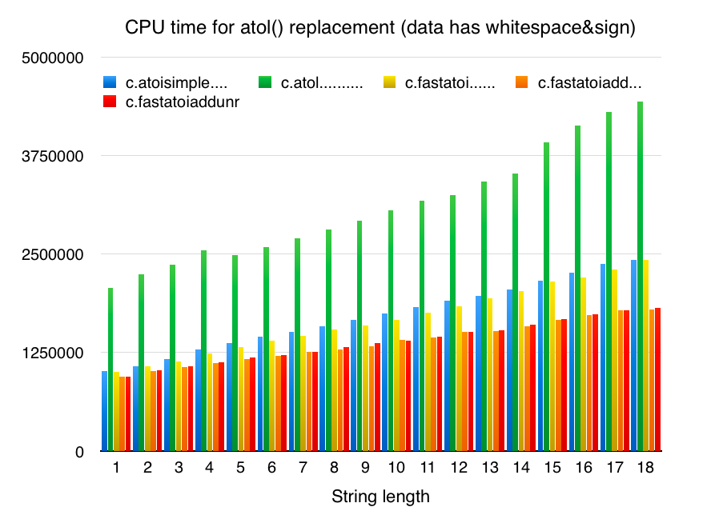

# fast-atoi
Improve the performance of atoi() 

Following the advice of Andrei Alexandrescu in his lecture "Writing Fast Code" on code::dive 2015 conference I am trying to provide a faster equivalent for atoi() but maximize the backward compatibility. 

# Use case 

You have legacy code using atoi() where you want to improve the string parsing performance. It would be very easy to make a specialized string->int parsing routine if the format of the input was guaranteed, e.g. each number was unsigned and exactly four digits long. However there are cases where the strings sent to atoi() come from an external client so you cannot assume conveniently that the strings have no starting whitespace or include non-numeric characters at the end.

# Specification

The atoi() function does the following:

* discards whitespace characters from the beginning of the string - whitespace characeters are those for which isspace() is true
* recognizes the optional "+" or "-" sign
* parses the immediately following maximal string of base-10 digits and converts it into a numerical value
* additional non-numerich characters are ignored
* invalid number or no number results in a result of 0

# Performance testing

Here are results for one particular system/compiler/compiler options configuration (full optimization).

CPU time chart: 

Elapsed time chart: 

# Reference

[C++reference](http://www.cplusplus.com/reference/cstdlib/atoi/)

